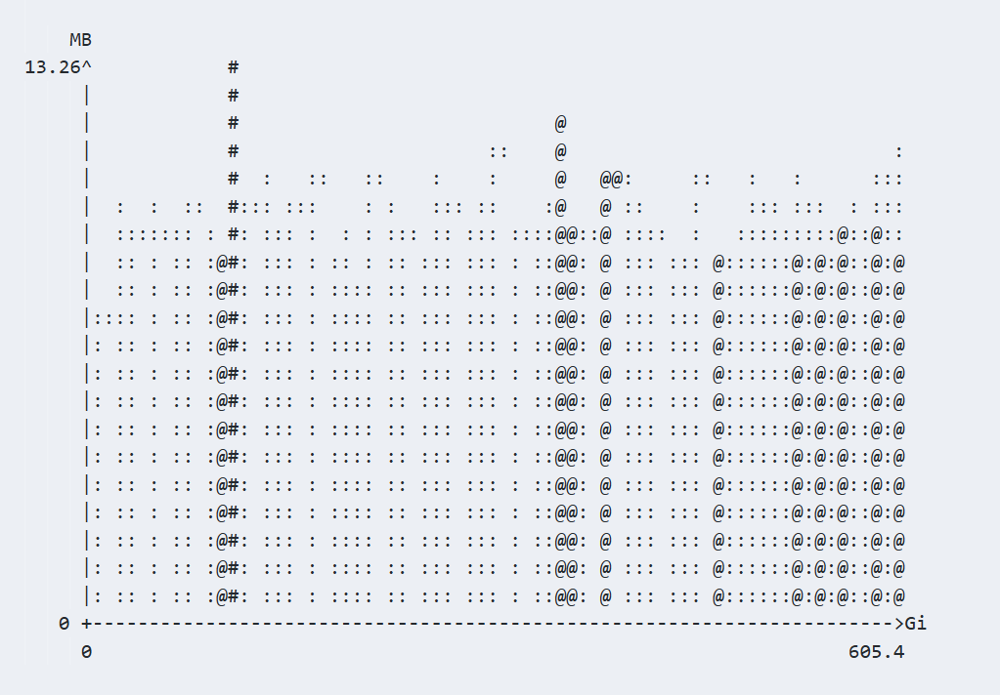
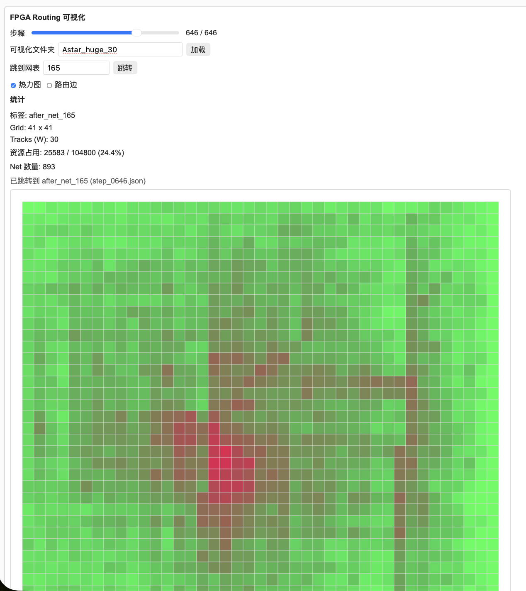
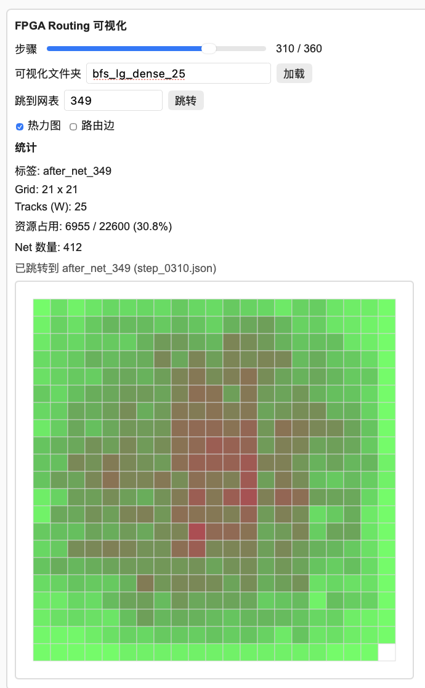
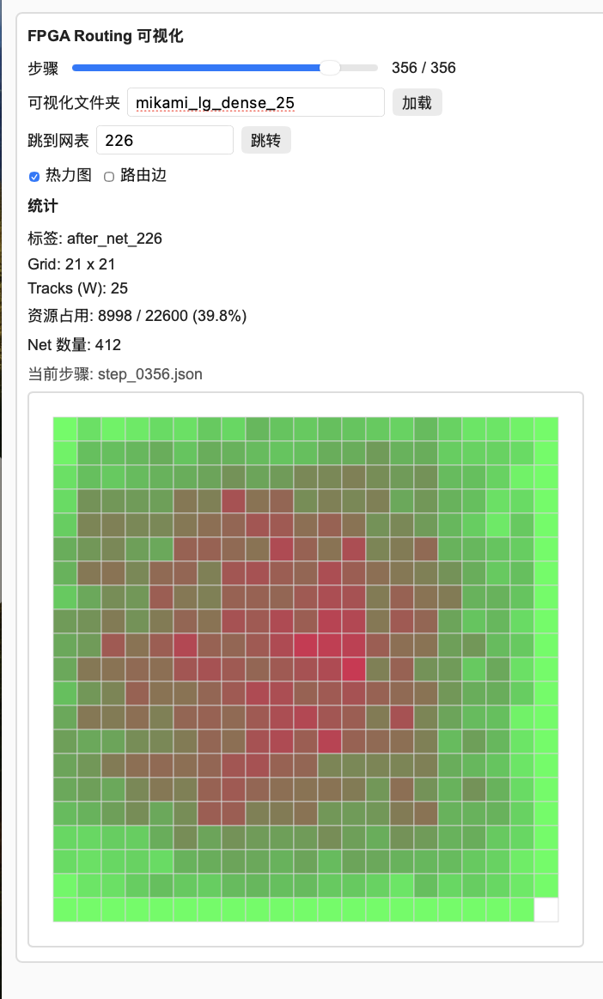
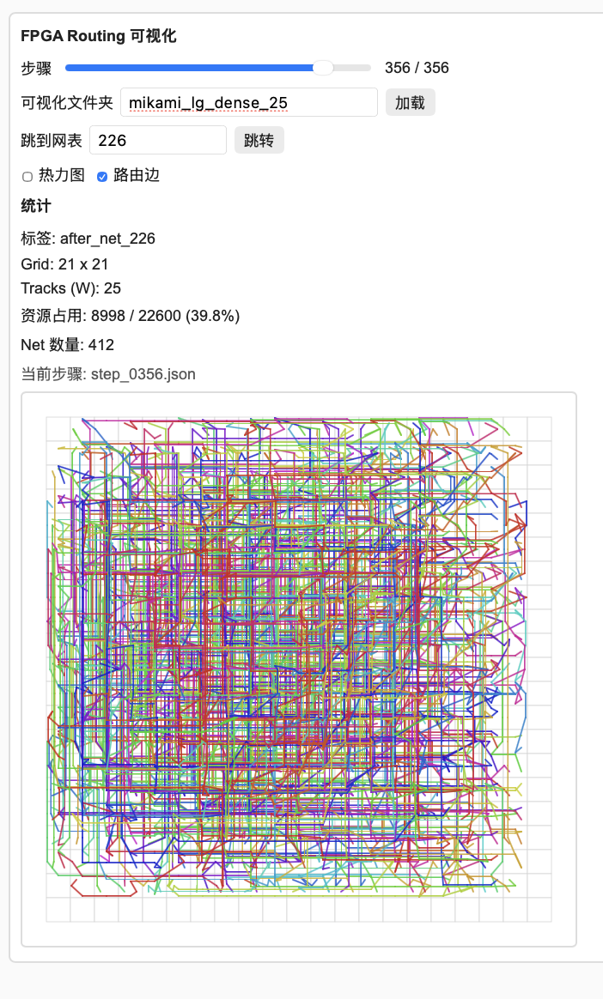
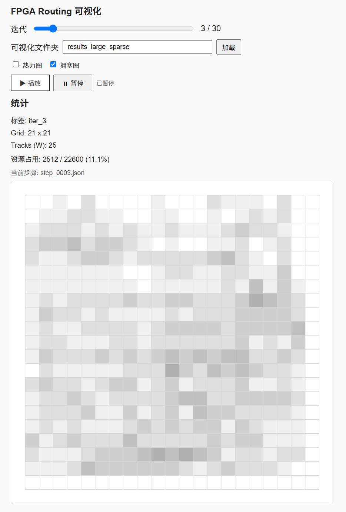
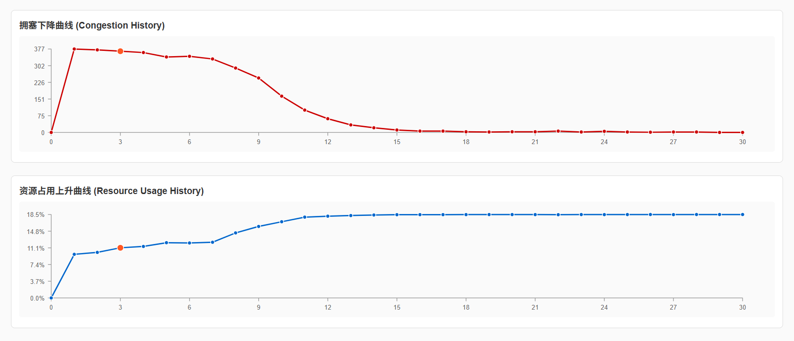

# FPGA 协商布线器

**📖 项目文档与在线演示：[https://simon-vr.github.io/FPGA-Router-Experiment/](https://simon-vr.github.io/FPGA-Router-Experiment/)**

面向教学的 FPGA 布线器，支持 BFS / A* / Mikami–Tabuchi 详细布线与基于 PathFinder 的协商布线，并使用 OpenMP 并行加速。

[English Docs](README.md)

**课程主页：** [customized-computing.github.io/VLSI-FPGA](https://customized-computing.github.io/VLSI-FPGA/#/)


---

## 项目亮点

- **教学级 FPGA 布线器** —— 清晰、易读地实现「全局布线 → 详细布线 → 协商布线」的完整流程。
- **RR graph 建模** —— N×N tile 网格，包含 H_WIRE / V_WIRE / CB_WIRE 资源节点；`RRNode.net` 记录资源占用。
- **多种详细布线器** —— BFS、A*（Manhattan 启发式）与 Mikami–Tabuchi（按节点类型扩展的双端线搜索）。
- **PathFinder 协商布线** —— 拥塞感知的拆线重布，结合历史代价与当前代价；并行路由计算 + 串行提交。
- **OpenMP 并行** —— 多线程路由，且结果确定（并行不改变解）。
- **可视化回放** —— 逐步 JSON dump，配合轻量浏览器查看器（`vistual/index.html`）。

## 算法概览

1. **全局布线（`sortNets`）** —— 按 net 的 bounding box 内全局引脚数升序排序。
2. **拆线（`disassemble_mst`）** —— 以 Manhattan 距离为边权，用 Kruskal MST 将每个 net 拆成双端连接。
3. **详细布线（`singleroute_bfs` / `singleroute_astar` / `singleroute_mikami`）** —— 在 RR graph 上为每条双端连接布线。
4. **协商布线（`NegotiatedRouter`）** —— 迭代地拆线重布拥塞 net，代价函数采用 PathFinder 公式：

   ```text
   cost(v, t) = (1 + h(v)) · p(v, t) · (1 + 0.1 · t)
   ```

   其中 `h(v)` 为累计历史拥塞，`p(v, t)` 为当前拥塞，`t` 为迭代轮次。路由使用 OpenMP 并行计算、串行提交。

## 构建与运行

```bash
# 使用 CMake 配置并构建
cmake -S . -B build
cmake --build build -j

# 已有构建目录时等价于：
cd build && make all
```

可执行文件位于 `./build/main`。

### 命令行参数

```text
./build/main <circuit> <W> [out_dir] [router_type] [maxiter] [threads] [visual]
```

| 参数            | 说明                                                 | 默认值             |
| --------------- | ---------------------------------------------------- | ------------------ |
| `circuit`     | 电路文件路径，如`./benchmark/tiny`                 | —                 |
| `W`           | 布线通道宽度（track 数）                             | —                 |
| `out_dir`     | 输出目录                                             | `annual_results` |
| `router_type` | `bfs` \| `astar` \| `mikami` \| `negotiated` | `bfs`            |
| `maxiter`     | 最大迭代次数（仅协商布线）                           | `30`             |
| `threads`     | OpenMP 线程数（仅协商布线）                          | `4`              |
| `visual`      | 输出逐步可视化 JSON（仅协商布线）                    | `false`          |

向后兼容别名：`my` → `bfs`、`a*` → `astar`。

> **注意：** `visual` 默认为 `false`。本文实验结果均在 `visual=false` 下运行，因此不生成任何逐步 JSON。

### tiny 冒烟示例

```bash
./build/main ./benchmark/tiny 30 smoke_out bfs
```

其他详细布线示例：

```bash
./build/main ./benchmark/lg_sparse 30 detail_out mikami
```

协商布线示例：

```bash
./build/main ./benchmark/med_dense 25 results_negotiated \
             negotiated 50 16 false
```

## 实验结果

所有结果均在给定 benchmark（`lg_sparse`、`large_dense`、`huge`；协商布线为 `med_dense`、`large_dense`、`huge`）上顺序测得。

### A) 详细布线对比（W = 30）

| benchmark   | 方法   | 成功连接/总连接 | Segments |      验证      | 耗时(s) |
| ----------- | ------ | --------------: | -------: | :-------------: | ------: |
| lg_sparse   | bfs    |         338/338 |     4056 |    ✅ passed    |       1 |
| lg_sparse   | astar  |         338/338 |     4067 |    ✅ passed    |       1 |
| lg_sparse   | mikami |         338/338 |     4062 |    ✅ passed    |       1 |
| large_dense | bfs    |       1028/1028 |    11939 |    ✅ passed    |       3 |
| large_dense | astar  |       1028/1028 |    11968 |    ✅ passed    |       2 |
| large_dense | mikami |       1028/1028 |    11945 |    ✅ passed    |       2 |
| huge        | bfs    |       2307/2307 |    46819 |    ✅ passed    |      37 |
| huge        | astar  |       2307/2307 |   46928 |    ✅ passed    |      23 |
| huge        | mikami |       2307/2307 |    46769 |    ✅ passed    |      22 |

**要点：** 三种详细布线器在三个 benchmark 上均完成并验证通过，线长差异 < 1.5%。在 `huge` 上，`mikami` 最快且线长最短。

### B) 详细布线压力（large_dense, W = 25）

| 方法   | 成功连接/总连接 |            验证 | 耗时(s) |
| ------ | --------------: | --------------: | ------: |
| bfs    |       1028/1028 | ✅ passed |       6 |
| astar  |       1028/1028 | ✅ passed |       1 |
| mikami |       1028/1028 | ✅ passed |       1 |

**要点：** 三种详细布线器在更紧的 W = 25 下均完成并验证通过（`Segments` 12043 / 12180 / 12105）。独立的协商布线引擎在 `large_dense` W = 25 下仍未收敛（见表 E）。

### C) 协商布线收敛（med_dense, 16 线程, maxiter=50）

|  W | 收敛 | 迭代 | Segments |      验证      | 耗时(s) |
| -: | :--: | ---: | -------: | :-------------: | ------: |
| 30 |  ✅  |   39 |     2960 |    ✅ passed    |       3 |
| 25 |  ✅  |   35 |     2970 |    ✅ passed    |       3 |
| 20 |  ❌  |   50 |     2940 | ❌ not complete |       3 |

**要点：** 临界通道宽度在 W=20–25 之间；W=25 收敛更快。

### D) 并行加速比（med_dense, W = 25, maxiter=50）

| 线程数 | 收敛迭代 | 耗时(s) | 相对 4 线程加速 | Segments |   验证   |
| -----: | -------: | ------: | --------------: | -------: | :-------: |
|      4 |       35 |       7 |          1.00× |     2970 | ✅ passed |
|      8 |       35 |       4 |          1.75× |     2970 | ✅ passed |
|     16 |       35 |       3 |          2.33× |     2970 | ✅ passed |

**要点：** 迭代数与解质量完全一致，并行不改变结果；受串行提交 / Amdahl 限制未完全线性，16 线程较 4 线程约 2.33×。

### E) 大规模协商布线（18 线程, maxiter=50）

| benchmark   |  W | 收敛 | 迭代 | 最终拥塞节点 | Segments |      验证      | 耗时(s) |
| ----------- | -: | :--: | ---: | -----------: | -------: | :-------------: | ------: |
| lg_sparse   | 30 |  ✅  |   20 |            0 |     4176 |    ✅ passed    |       4 |
| lg_sparse   | 25 |  ✅  |   29 |            0 |     4181 |    ✅ passed    |       6 |
| large_dense | 30 |  ❌  |   50 |          170 |    12200 | ❌ not complete |      35 |
| large_dense | 25 |  ❌  |   50 |          420 |    11949 | ❌ not complete |      31 |
| huge        | 30 |  ❌  |   50 |          431 |    48370 | ❌ not complete |     423 |
| huge        | 25 |  ❌  |   50 |         1202 |    47771 | ❌ not complete |     477 |

**要点：** 仅 `lg_sparse` 收敛；`large_dense` W=30 拥塞较 W=25 明显改善（170 vs 420）但仍不足；`huge` 单条 7–8 分钟，均未收敛。

### 可复现命令

```bash
cmake -S . -B build && cmake --build build -j
bash scripts/run_experiments.sh      # → test_logs/*.log
python3 scripts/parse_results.py     # → experiment_results.json
```

## 内存分析

协商布线器的内存剖析（Valgrind Massif，med_dense，W = 25，16 线程）：

| 指标     |     数值 |
| -------- | -------: |
| 峰值内存 | 13.26 MB |
| 最终内存 | 10.67 MB |
| 有用堆   |  8.72 MB |
| 额外开销 |  1.94 MB |



## 可视化与在线文档

文档资源与渲染图位于 [`docs/`](docs/)（GitHub Pages）。示例图：

|                                                                                         |                                                                                       |
| --------------------------------------------------------------------------------------- | ------------------------------------------------------------------------------------- |
|                        |          |
|  |  |
|                         |                       |

在线查看器的预渲染数据位于 [`docs/data/`](docs/data/)：

- [`docs/data/huge.json`](docs/data/huge.json)
- [`docs/data/large_sparse.json`](docs/data/large_sparse.json)
- [`docs/data/large_dense.json`](docs/data/large_dense.json)

如需在本地回放布线过程，请在仓库根目录启动静态服务器并打开查看器：

```bash
python3 -m http.server 8000
# 浏览器打开 http://localhost:8000/vistual/index.html
```

查看器读取 `docs/data/*.json` 抽样逐步数据，提供迭代滑条、热力图 / 拥塞图切换、播放 / 暂停（800ms/步）以及拥塞 / 资源占用折线图。（服务器需在仓库根目录启动，因为数据位于 `vistual/` 之外。）

## 致谢与许可

- 本项目为 **VLSI 设计导论** 课程项目，用于教学与 FPGA 布线算法学习。
- 协商布线遵循经典 **PathFinder** 框架；详细布线采用 BFS、A*（Manhattan 启发式）与 **Mikami–Tabuchi** 线搜索方法。
- 基于 MIT 许可证发布，供教学使用。
